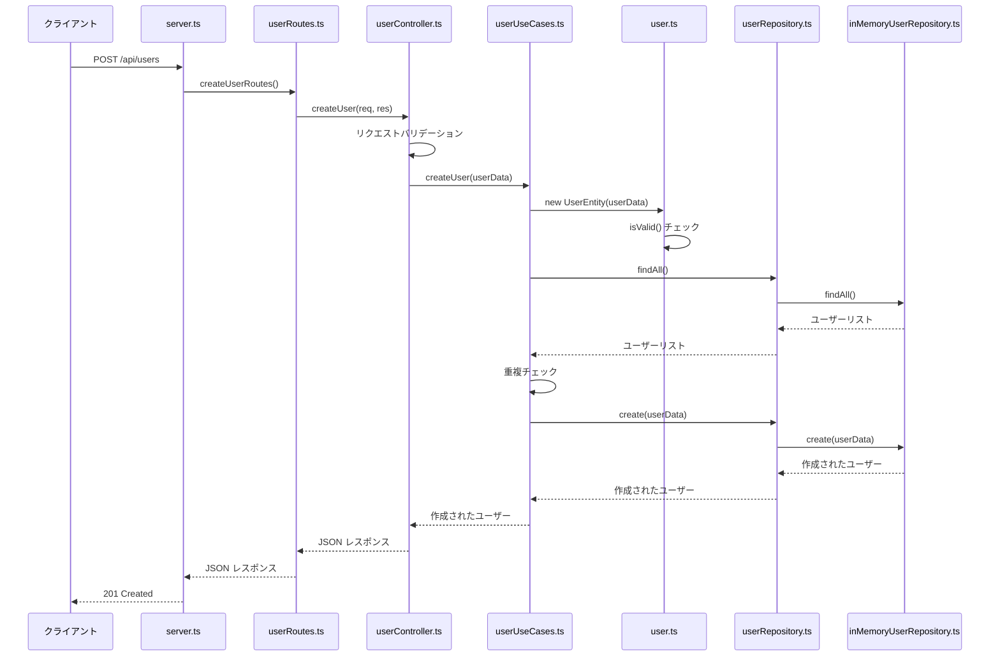
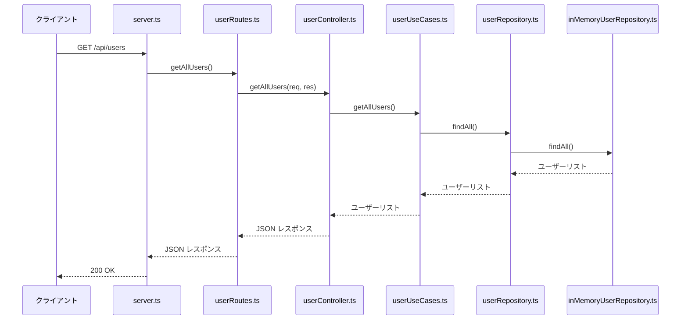
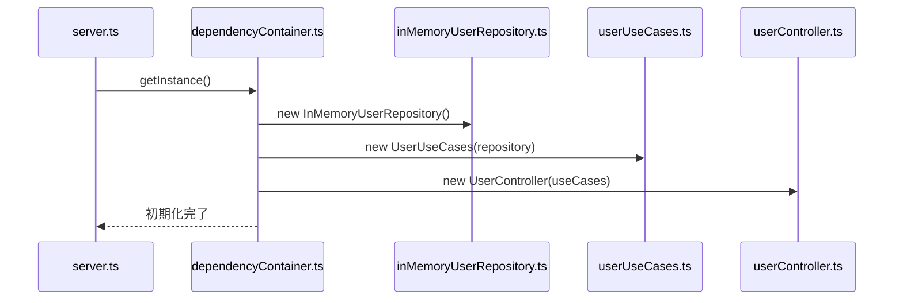

# TypeScript Express サーバー (Clean Architecture)

TypeScript で書かれた Express サーバーのサンプルプロジェクトです。Clean Architecture の原則に従って構築されています。

## セットアップ

依存関係をインストールします：

```bash
pnpm install
```

## 開発サーバーの起動

開発モードでサーバーを起動します：

```bash
pnpm dev
```

サーバーは `http://localhost:3000` で起動します。

## ビルドと本番実行

TypeScript を JavaScript にコンパイルします：

```bash
pnpm build
```

コンパイルされたサーバーを実行します：

```bash
pnpm start
```

## 利用可能なエンドポイント

- `GET /` - サーバーの状態確認
- `GET /health` - ヘルスチェック
- `GET /api/users` - ユーザー一覧の取得
- `GET /api/users/:id` - 特定のユーザー取得
- `POST /api/users` - 新しいユーザーの作成
- `PUT /api/users/:id` - ユーザー情報の更新
- `DELETE /api/users/:id` - ユーザーの削除

## プロジェクト構造 (Clean Architecture)

```
ts-playground/
├── src/
│   ├── entities/                    # ビジネスロジックの中心
│   │   └── User.ts                 # ユーザーエンティティ
│   ├── useCases/                   # アプリケーションのビジネスルール
│   │   └── UserUseCases.ts         # ユーザー関連のユースケース
│   ├── interfaceAdapters/          # 外部インターフェース
│   │   ├── controllers/            # HTTPコントローラー
│   │   │   └── UserController.ts   # ユーザーコントローラー
│   │   └── repositories/           # データアクセス抽象化
│   │       └── UserRepository.ts   # ユーザーリポジトリインターフェース
│   ├── frameworks/                  # 外部フレームワーク
│   │   ├── express/                # Express関連
│   │   │   ├── DependencyContainer.ts # 依存性注入コンテナ
│   │   │   └── UserRoutes.ts       # ユーザールート
│   │   └── database/               # データベース関連
│   │       └── InMemoryUserRepository.ts # インメモリリポジトリ実装
│   └── server.ts                   # アプリケーションエントリーポイント
├── package.json                    # プロジェクト設定
├── tsconfig.json                   # TypeScript設定
└── README.md                      # このファイル
```

## 技術スタック

- **Node.js** - ランタイム環境
- **Express** - Web フレームワーク
- **TypeScript** - 型安全な JavaScript
- **ts-node** - TypeScript の直接実行

## Clean Architecture の利点

- **テスタビリティ** - 各レイヤーが独立してテスト可能
- **保守性** - ビジネスロジックが外部依存から分離
- **拡張性** - 新しい機能やフレームワークの追加が容易
- **依存関係の方向** - 内側のレイヤーは外側のレイヤーに依存しない

## 処理フロー (シーケンス図)

### ユーザー作成の処理フロー



### ユーザー取得の処理フロー



### 依存性注入の初期化フロー


